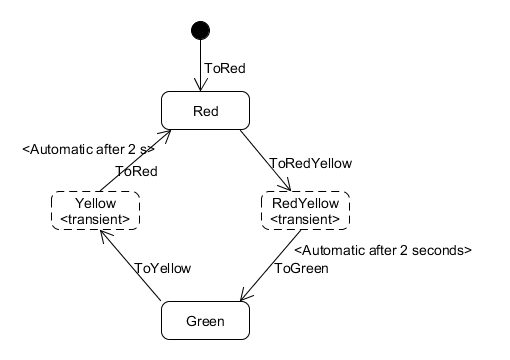

# MassTransitDemo
This code demonstrates [CQRS principles](http://udidahan.com/2009/12/09/clarified-cqrs/) using [MassTransit](http://masstransit-project.com/) 
and [RabbitMQ](http://www.rabbitmq.com/).

## Parts

### Overview

The system consist of four apps that communicate by sending messages via RabbitMQ.
It is divided into to logical parts. One that shows the basic use of messaging and CQRS,
and one that shows how to use a statemachine with messaging.

### Contract
The contract defines the messages the apps use for communication.

There are three kinds of messages:
* Command: Tell the receiver to do something.
* Event: Notify everyone that something has happened.
* Query: Ask for specific information

#### Command vs Query

A command is message that tells the receiver to do something. It changes data.
 When a command is received it is validated and the validation result is returned to the sender.
 Then the command is then executed and data that is changed is sent out as an event.
 
 Example:
 1. Client sends a DoStuff command
 2. Server validates the command and returns the validation result. No data is changed yet.
 3. Server executes the command and changes data.
 4. Server sends a StuffChanged event that describes the changes.
 5. Client receives the event and updates the display  

A query is a request for data. It does NOT change any data.

### Server
The server application is a simple application that shows the usage of commands.
It handles three different messages:
1. DoStuff. Responds with "Validated OK", then sends a StuffChanged event.
2. DoOtherStuff. Responds with "Validated OK", then sends an OtherStuffChanged event.
3. DoBadStuff. Throws an exception

### TrafficLightServer
The traffic light server handles traffic lights. Each light has an id-number and a state
that according to the following state diagram. 

The state machine is implemented using [Stateless](https://github.com/dotnet-state-machine/stateless)
a .NET framework framework for state machines. 
The state machine has five states (Initial, Red, RedYellow, Green and Yellow) and four triggers
(ToRed, ToRedYellow, ToGreen and ToYellow) that moves to a new state.

The traffic light server handles the following messages:
1. CreateTrafficLightCommand. Creates a new traffic light and immediately fires the ToRed trigger.
2. GoCommand. Fires the ToRedYellow trigger (ToGreen is fired after 2 seconds)
3. StopCommand. Fires the ToYellow trigger (ToRed is fired after 2 seconds).
4. StateQuery. Responds with the current state of a traffic light.

### Client
Simple console application that can send commands to Server and TrafficLightServer.
It also displays all events sent by the servers.

### TrafficLightDisplay
Simple WPF application displaying traffic lights and their state.

